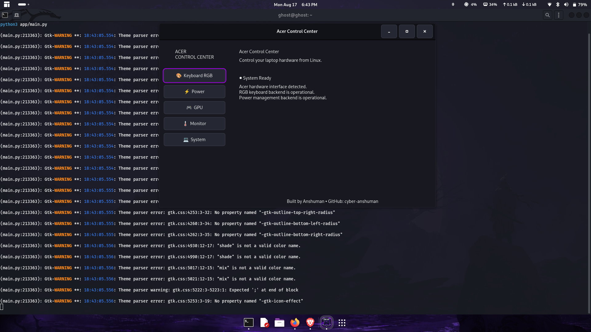
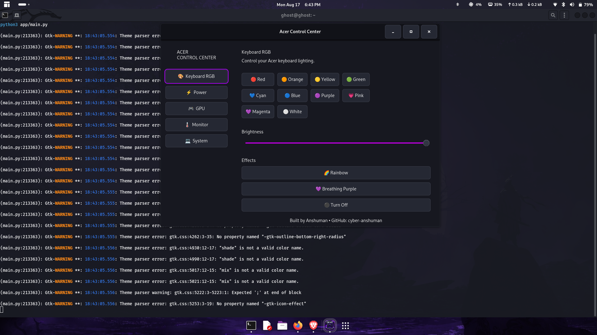
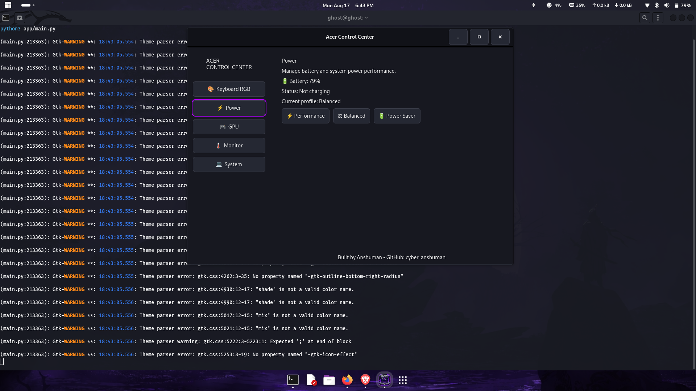
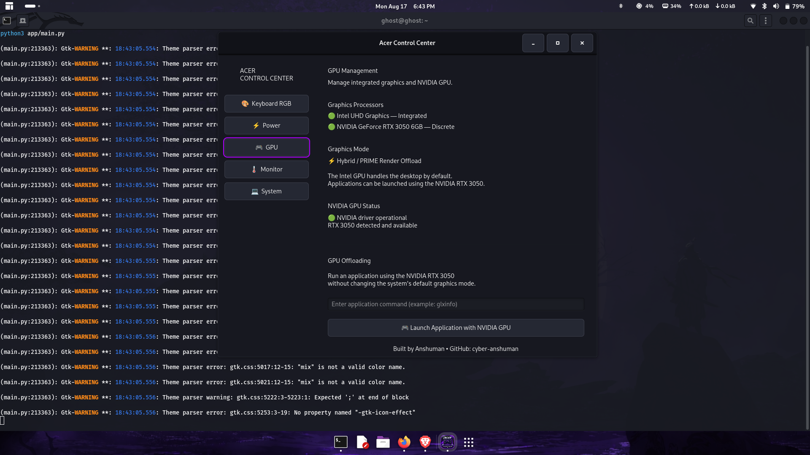
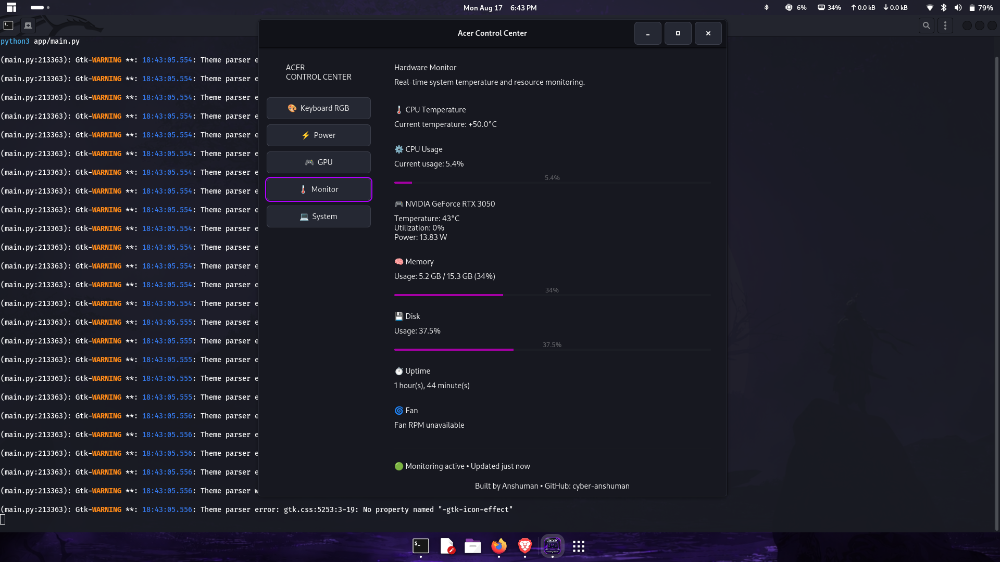
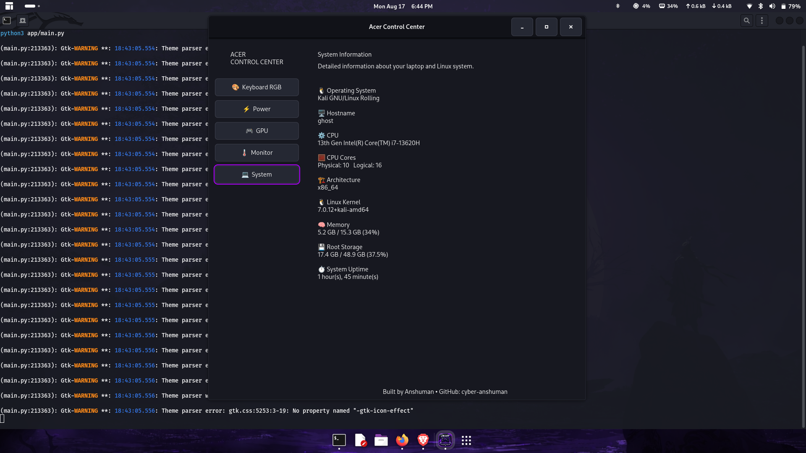

# Acer Control Center for Linux

A lightweight Linux control center for Acer laptops, providing a graphical interface to monitor and control system hardware and power features.

> Built for Linux users who want an Acer Control Center-style experience without relying on Windows-only software.

## ✨ Features

- 🖥️ System information and hardware detection
- ⚡ Power profile control
- 🌡️ System temperature and sensor monitoring
- 🎮 NVIDIA GPU information
- ⌨️ Keyboard RGB control
- 📊 Hardware monitoring
- 🐧 Designed for Linux
- 🎨 GTK-based graphical interface
- 🚀 Simple installation script
- 🖥️ Desktop application launcher

## 📸 Screenshots

### Main Interface



### System Information



### Power Controls



### Hardware Monitoring



### GPU Information



### Keyboard RGB



## 🎥 Demo

A short demonstration of Acer Control Center running on Linux:

[▶️ Watch the demo](https://github.com/cyber-anshuman/acer-control-center-linux/blob/main/demo/acer-control-center-demo.mp4)

## 🛠️ Installation

### Requirements

- Linux
- Python 3
- GTK 4
- PyGObject
- psutil
- `sudo` access

### Install

Clone the repository:

```bash
git clone https://github.com/cyber-anshuman/acer-control-center-linux.git
cd acer-control-center-linux
Run the installer:

```bash
sudo ./install.sh
